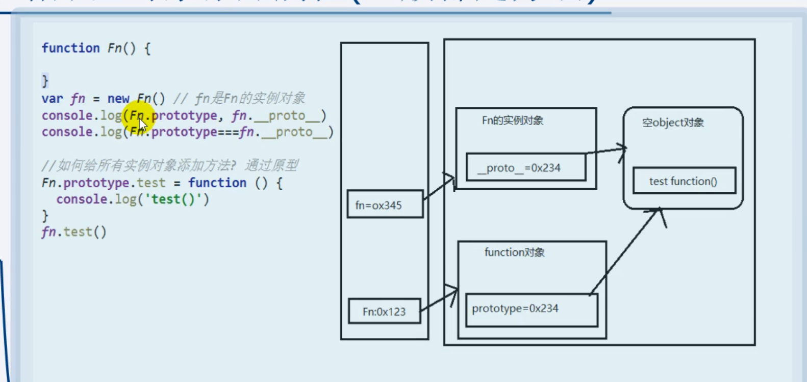
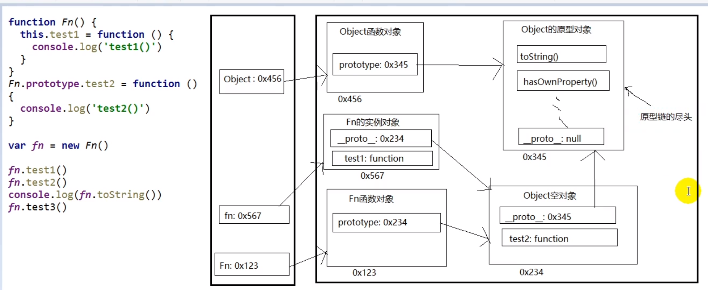

##       函数高级

### 原型与原型链

#### 原型（prototype）

- 每个函数都有prototype属性，默认指向一个Object空实例对象（没有我们指定的属性或方法）（即称为：原型对象）（Object 不满足，它的原型对象）
-  原型对象中有一个属性constructor 它指向函数对象
-  函数作为普通函数调用 prototy没有任何作用
-  原型对象相当于一个公共的区域，所有同一个类的实例都可以访问到这个原型对象
-  可以将对象中共有的内容，统一设置到原型对象中

#### 显示原型与隐式原型

- 每个函数function都有一个prototype，即显式原型属性（函数定义时自动添加）
- 每个实例对象都有一个`__proto__`，可称为隐式原型属性（创建实例对象时自动添加）
- 对象的隐式原型的值为其对应构造函数的显式原型的值



```javascript
function Foo() { }
var Foo = new Function()

Function = new Function
Foo.__proto__ = Function.prototype
Function.__proto__ = Function.prototype
Function 的隐式原型和显式原型指向同一个对象
```

所有函数都是Function 的实例

所有函数的 `__proto__` 都一样，都是Function的显式原型

#### 原型链

- 当访问对象的一个属性或方法时，会现在对象自身中寻找，没有找到时，则会去原型对象中寻找
- Object的原型对象是原型链的尽头 ` Object.prototype.__proto__ = null `




#### 原型链 属性问题

读取对象的属性值时，会自动到原型链中查找

设置对象的属性值时，不会查找原型链，如果当前对象中没有此属性，直接添加此属性并设置其值

方法一般定义在原型中，属性一般通过构造函数定义在对象本身上

### 词法作用域和动态作用域

词法作用域（静态作用域）：函数的作用域在函数定义的时候确定

动态作用域：函数的作用域在函数调用的时候确定

```js
var value = 1
function foo() {
    console.log(value)
}
function bar() {
    var value = 2
    foo()
}
bar()
// 在静态作用域中会输出1
// 在动态作用域中会输出2
```

JS采用词法作用域（静态作用域），因此输出1

### 执行上下文与执行上下文栈

#### 变量提升与函数提升

先执行变量提升，在执行函数提升

```javascript
var a = 3
function fn() {
    console.log(a)
    var a = 4
}
fn()   // 输出undefined
```

1. 变量声明提升

   - 通过var定义（声明）变量，在定义语句之前就可以访问到

   - 值：undefined

2. 函数声明提升
   - 通过function声明的函数，在之前就可以直接调用


#### 执行上下文

##### 全局执行上下文

1. 在执行全局代码前将window确定为全局执行上下文
2. 对全局数据进行预处理
   - var定义的全局变量 ==> undefined，添加为window的属性
   - function声明的全局函数==> 赋值（fun） 添加为window的方法
   - this ==> 赋值（window）
3. 开始执行全局代码

##### 函数执行上下文


1. 在调用函数，准备执行函数体之前，创建对应的函数执行上下文对象(虚拟的，存在于栈中)
 	2. 对局部数据进行预处理
     + 形参变量 ==>赋值（实参）==> 添加为执行上下文的属性
     + arguments ==> 赋值（实参列表）添加为执行上下文的属性
     + var定义的局部变量 ==> undefined，添加为执行上下文的属性
     + function声明的函数 ==> 赋值，添加为执行上下文的属性
     + this ==> 赋值（调用）
	3. 开始执行函数体代码

```javascript
console.log('---------')
//函数执行上下文
function fn (a1) {
    console.log(a1)  // 2
    console.log(a2)	 // undefined
    a3()  	// a3()
    console.log(this)  //window
    console.log(arguments)  // 伪数组(2,3)
    var a2 = 5
    function a3() {
        console.log('a3()')
    }
}
fn(2,3)
```

在进入执行上下文时，首先会处理函数声明，其次会处理变量声明，如果如果变量名称跟已经声明的形式参数或函数相同，则变量声明不会干扰已经存在的这类属性。 

```js
console.log(foo);

function foo(){
    console.log("foo");
}

var foo = 1;  
```

结果会打印函数，而不是undefined

#### 执行上下文栈

1. 在全局代码执行前，JS引擎就会创建一个栈来存储管理所有的执行上下文对象
2. 在全局执行上下文（window）确定后，将其添加到栈中（压栈）
3. 在函数执行上下文创建后，将其添加到栈中（压栈）
4. 在当前函数执行完后，将栈顶的对象移除（出栈）
5. 当所有的代码执行完之后，栈中只剩下window

以下面代码为例，具体分析执行上下文栈和执行上下文的变化过程

```js
var scope = "global scope";
function checkscope(){
    var scope = "local scope";
    function f(){
        return scope;
    }
    return f();
}
checkscope();
```

1.执行全局代码，创建全局执行上下文，全局上下文被压入执行上下文栈

```js
    ECStack = [
        globalContext
    ];
```

2.全局上下文初始化

```js
    globalContext = {
        VO: [global],
        Scope: [globalContext.VO],
        this: globalContext.VO
    }
```

2.初始化的同时，checkscope 函数被创建，保存作用域链到函数的内部属性[[scope]]

```
    checkscope.[[scope]] = [
      globalContext.VO
    ];
```

3.执行 checkscope 函数，创建 checkscope 函数执行上下文，checkscope 函数执行上下文被压入执行上下文栈

```
    ECStack = [
        checkscopeContext,
        globalContext
    ];
```

4.checkscope 函数执行上下文初始化：

1. 复制函数 [[scope]] 属性创建作用域链，
2. 用 arguments 创建活动对象，
3. 初始化活动对象，即加入形参、函数声明、变量声明，
4. 将活动对象压入 checkscope 作用域链顶端。

同时 f 函数被创建，保存作用域链到 f 函数的内部属性[[scope]]

```
    checkscopeContext = {
        AO: {
            arguments: {
                length: 0
            },
            scope: undefined,
            f: reference to function f(){}
        },
        Scope: [AO, globalContext.VO],
        this: undefined
    }
```

5.执行 f 函数，创建 f 函数执行上下文，f 函数执行上下文被压入执行上下文栈

```
    ECStack = [
        fContext,
        checkscopeContext,
        globalContext
    ];
```

6.f 函数执行上下文初始化, 以下跟第 4 步相同：

1. 复制函数 [[scope]] 属性创建作用域链
2. 用 arguments 创建活动对象
3. 初始化活动对象，即加入形参、函数声明、变量声明
4. 将活动对象压入 f 作用域链顶端

```
    fContext = {
        AO: {
            arguments: {
                length: 0
            }
        },
        Scope: [AO, checkscopeContext.AO, globalContext.VO],
        this: undefined
    }
```

7.f 函数执行，沿着作用域链查找 scope 值，返回 scope 值

8.f 函数执行完毕，f 函数上下文从执行上下文栈中弹出

```
    ECStack = [
        checkscopeContext,
        globalContext
    ];
```

9.checkscope 函数执行完毕，checkscope 执行上下文从执行上下文栈中弹出

```
    ECStack = [
        globalContext
    ];
```


### 作用域与作用域链

#### 作用域

全局作用域

函数作用域

块作用域（ES6中有）

#####  作用域与执行上下文

###### 区别

1. 全局作用域之外，每个函数都会创建自己的作用域，作用域在函数定义的时候已经确定，而不是在函数调用时
2. 全局执行上下文环境是在全局u总用于确定之后，js代码马上执行之前创建
3. 函数执行上下文是在调用函数时，函数体代码执行之前创建
4. 作用域是静态的，只要函数定义好了就一直存在，且不会在变化
5. 上下文环境是动态的，调用函数时创建，函数调用结束时上下文环境就会被释放

##### 联系

1. 上下文环境（对象）是从属与所在的作用域
2. 全局上下文环境 ==> 全局作用域
3. 函数上下文环境 ==> 对应的函数使用域

以下面的例子为例，结合着之前讲的变量对象和执行上下文栈，我们来总结一下函数执行上下文中作用域链和变量对象的创建过程：

```
var scope = "global scope";
function checkscope(){
    var scope2 = 'local scope';
    return scope2;
}
checkscope();
```

执行过程如下：

1.checkscope 函数被创建，保存作用域链到 内部属性[[scope]]

```
checkscope.[[scope]] = [
    globalContext.VO
];
```

2.执行 checkscope 函数，创建 checkscope 函数执行上下文，checkscope 函数执行上下文被压入执行上下文栈

```
ECStack = [
    checkscopeContext,
    globalContext
];
```

3.checkscope 函数并不立刻执行，开始做准备工作，第一步：复制函数[[scope]]属性创建作用域链

```
checkscopeContext = {
    Scope: checkscope.[[scope]],
}
```

4.第二步：用 arguments 创建活动对象，随后初始化活动对象，加入形参、函数声明、变量声明

```
checkscopeContext = {
    AO: {
        arguments: {
            length: 0
        },
        scope2: undefined
    }，
    Scope: checkscope.[[scope]],
}
```

5.第三步：将活动对象压入 checkscope 作用域链顶端

```
checkscopeContext = {
    AO: {
        arguments: {
            length: 0
        },
        scope2: undefined
    },
    Scope: [AO, [[Scope]]]
}
```

6.准备工作做完，开始执行函数，随着函数的执行，修改 AO 的属性值

```
checkscopeContext = {
    AO: {
        arguments: {
            length: 0
        },
        scope2: 'local scope'
    },
    Scope: [AO, [[Scope]]]
}
```

7.查找到 scope2 的值，返回后函数执行完毕，函数上下文从执行上下文栈中弹出

```
ECStack = [
    globalContext
];
```


### 闭包

JavaScript 允许函数嵌套，并且内部函数可以访问定义在外部函数中的所有变量和函数，以及外部函数能访问的所有变量和函数。但是，外部函数却不能够访问定义在内部函数中的变量和函数。这给内部函数的变量提供了一定的安全性。此外，由于内部函数可以访问外部函数的作用域，因此当内部函数生存周期大于外部函数时，外部函数中定义的变量和函数的生存周期将比内部函数执行时间长。当内部函数以某一种方式被任何一个外部函数作用域访问时，一个闭包就产生了。

~~~javascript
var pet = function(name) {          //外部函数定义了一个变量"name"
  var getName = function() {            
    //内部函数可以访问 外部函数定义的"name"
    return name; 
  }
  //返回这个内部函数，从而将其暴露在外部函数作用域
  return getName;               
};
myPet = pet("Vivie");
    
myPet();                            // 返回结果 "Vivie"
~~~


~~~javascript
var createPet = function(name) {
  var sex;
  
  return {
    setName: function(newName) {
      name = newName;
    },
    
    getName: function() {
      return name;
    },
    
    getSex: function() {
      return sex;
    },
    
    setSex: function(newSex) {
      if(typeof newSex == "string" 
        && (newSex.toLowerCase() == "male" || newSex.toLowerCase() == "female")) {
        sex = newSex;
      }
    }
  }
}

var pet = createPet("Vivie");
pet.getName();                  // Vivie

pet.setName("Oliver");
pet.setSex("male");
pet.getSex();                   // male
pet.getName();                  // Oliver
~~~


