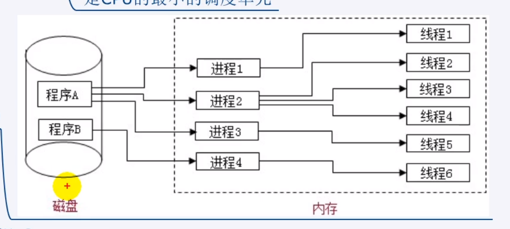
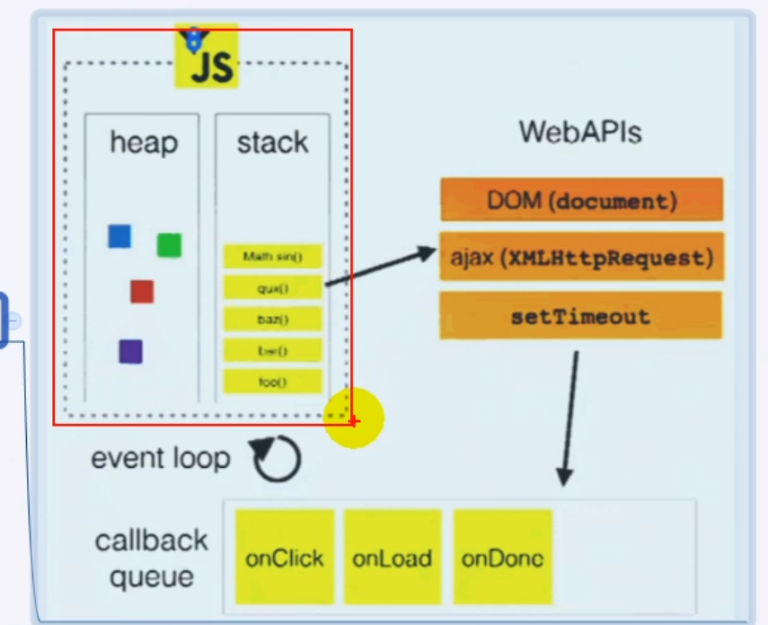

### 进程与线程

#### 进程

程序的一次执行，它占有独有的一片内存空间

#### 线程

是进程内的一个独立执行单元

是程序执行的一个完整流程

是CPU的最小的调度单元

#### 两者之间的关系

应用程序必须运行在某个进程的某个线程上

一个进程至少有一个运行的线程：主线程，进程启动后会自动创建

一个进程也可以同时运行多个线程，我们会说程序是多线程运行的

一个进程内的数据可以供其中多个线程直接共享

多个进程之间的数据不能直接共享

线程池（thread pool）：保存多个线程对象的容器，实现线程对象的反复利用

#### 相关问题

##### 多进程和多线程

多进程：一个应用程序可以启动多个实例运行

多线程：一个进程内，同时有多个线程运行

##### 单线程与多线程

###### 多线程

优点 ：

- 有效提升CPU的利用率

缺点：

- 创建多线程开销

- 线程间切换开销

- 死锁与状态同步问题

###### 单线程：

优点：

- 顺序编程简单易懂

缺点

- 效率低

##### JS是单线程还是多线程的？

单线程运行

但使用H5中的Web Workers可以多线程运行

##### 浏览器运行时单线程还是多线程？

多线程运行

##### 浏览器运行时单进程还是多进程？

单进程：firefox 老版IE

多进程：chrome 新版IE

### 浏览器内核

支撑浏览器运行的最核心的程序

不同浏览器的内核可能不同：

- Chrome， Safari：webkit
- firefox：Gecko
- IE：Trident
- 360，搜狗：Trident + webkit

#### 内核由很多模块组成

##### 主线程

1. js引擎模块：负责js程序的编译与运行

2. html，css文档解析模块：负责页面文本的解析

3. DOM/CSS模块：负责dom/css在内存中的相关处理

4. 布局和渲染模块

5. ……

##### 分线程：

1. 定时器模块：负责定时器的管理

2. 事件响应模块：负责事件的管理

3. 网络请求模块：负责ajax请求

### 定时器

#### 定时器是真的定时执行的吗？

定时器并不能保证真正定时执行

一般会延迟一会（可以接受），也有可能延迟很长时间

#### 定时器回调函数是在分线程执行的吗？

在主线程执行。js是单线程的

#### 定时器的实现

事件循环模型

### JS是单线程执行的

初始化代码和回调代码

js引擎执行代码的基本流程：

先执行初始化代码，包含一些特别的代码

- 设置定时器

- 绑定事件监听

- 发送ajax请求

后面的某个时刻才会执行回调代码

2019GITHUB50-4cebe73e

### 事件循环模型

#### 相关重要概念

1. 执行栈

   所有代码在此空间中执行

2. 浏览器内核

   js引擎模块（主线程）

   定时器，DOM，ajax（分线程）

3. 任务队列

   callback queue

4. 消息队列

   callback queue

5. 事件队列

   callback queue

6. 事件轮询

   从任务队列中循环取出回调函数放入执行栈中处理

7. 事件驱动模型

8. 请求响应模型

### H5 Web Workers

H5规范提供了js分线程的实现，取名为Web Workers

我们可以将一些大计算量的代码交给Web Workers运行而不冻结用户界面

但是子线程完全受主线程控制，且不得操作DOM，所以这个新标准并没有改变Javascript单线程的本质

#### 使用

创建在分线程执行的js文件

~~~javascript
// worker.js
var onmessage = function(event) {
    console.log('分线程接收到主线程发送的数据',event.data)
    //计算
    ...
    var result = 0
    ...
    //返回数据
    postMessage(result)
}
~~~

在主线程的js中发消息并设置回调函数

~~~javascript
//创建一个Worker对象并向他传递将在新线程中执行的脚本的URL
var worker = new Worker("worker.js")
//接收worker传过来的数据函数
worker.onmesssage = function(event) {
    //主线程接受分线程的数据
    console.log(event.data)
}
//向worker发送数据
worker.postMessage(message)
~~~

